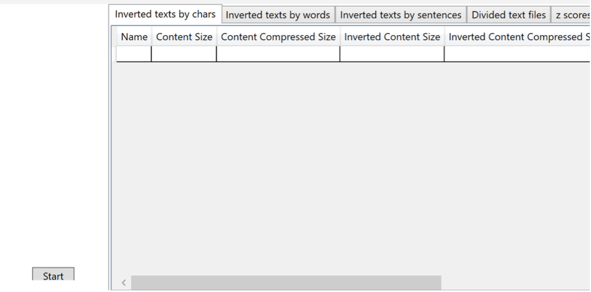
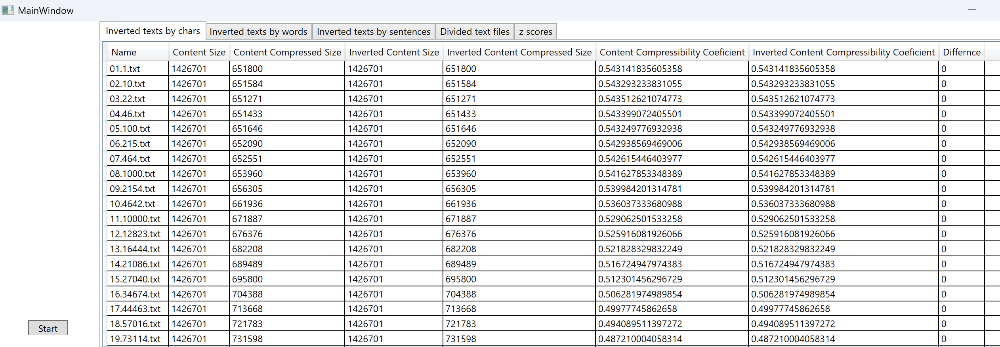
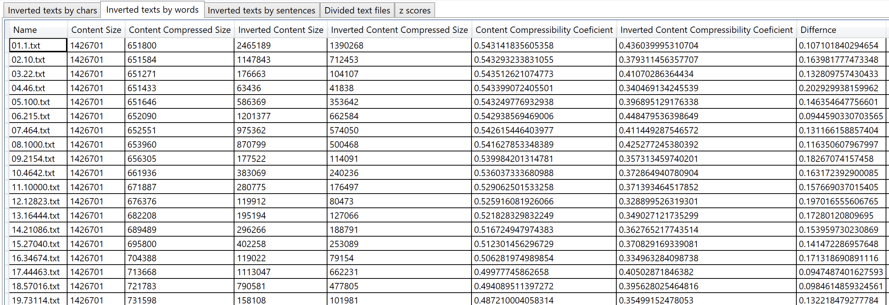
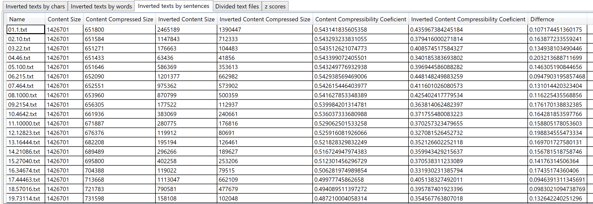
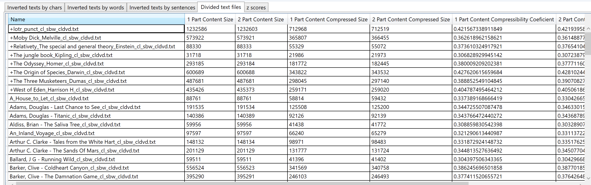
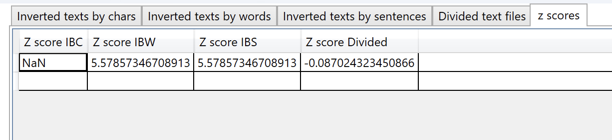

# Comperssability

> Desktop-застосунок для дослідження стисливості текстів після інвертування та рандомізації на різних лінгвістичних рівнях: символів, слів і речень.

---

## Автор

- **ПІБ**: Червинська Єлизавета Артемівна
- **Група**: ФеП-42
- **Освітня програма**: 121 - Інженерія програмного забезпечення
- **Керівник**: Кушнір Олег Степанович, доктор фізико-математичних наук, завідувач кафедри ОІТ
- **Дата виконання**: 20.05.2026

---

## Загальна інформація

- **Тип проєкту**: desktop-застосунок
- **Мова програмування**: C#
- **Технологія інтерфейсу**: WPF
- **Платформа**: .NET Framework 4.7.2
- **Середовище розробки**: Visual Studio
- **Основний алгоритм стиснення**: LZString
- **Формат вхідних даних**: текстові файли `.txt`

Програма використовується для аналізу того, як змінюється коефіцієнт стисливості тексту залежно від способу перетворення його структури. Для цього порівнюються початкові очищені тексти та їхні варіанти, інвертовані або рандомізовані на рівні символів, слів і речень.

---

## Опис функціоналу

Програма виконує такі дії:

- зчитує набори текстових файлів із підготовлених папок;
- стискає текст за допомогою бібліотеки `LZStringCSharp`;
- визначає розмір початкового та стисненого текстів;
- обчислює коефіцієнт стиснення;
- обчислює різницю між коефіцієнтами стиснення;
- формує таблиці результатів у графічному інтерфейсі;
- розраховує z-score для порівняння отриманих різниць.

Коефіцієнт стисливості обчислюється за формулою:

```text
K = (S_original - S_compressed) / S_original
```

де:

- `S_original` — розмір початкового текстового файлу;
- `S_compressed` — розмір стисненого представлення тексту;
- `K` — коефіцієнт стисливості.

---

## Структура проєкту

```text
Comperssability/
├── App.xaml
├── App.xaml.cs
├── MainWindow.xaml
├── MainWindow.xaml.cs
├── TextFile.cs
├── FullTextInfo.cs
├── Comperssability.csproj
├── packages.config
├── App.config
├── Properties/
├── bin/
└── obj/
```

---

## Опис основних файлів і класів

| Файл / клас | Призначення |
|---|---|
| `App.xaml` | Описує стартові параметри WPF-застосунку. |
| `App.xaml.cs` | Код запуску застосунку. |
| `MainWindow.xaml` | Опис графічного інтерфейсу програми: кнопка запуску, вкладки та таблиці результатів. |
| `MainWindow.xaml.cs` | Основна логіка програми: зчитування файлів, запуск обчислень, порівняння текстів, заповнення таблиць. |
| `TextFile.cs` | Клас для роботи з окремим текстовим файлом: збереження назви, вмісту, розміру, стиснення та коефіцієнта стисливості. |
| `FullTextInfo.cs` | Модель для зберігання результатів порівняння оригінального й інвертованого тексту. |
| `packages.config` | Список NuGet-залежностей проєкту. |
| `Comperssability.csproj` | Файл конфігурації C# / WPF-проєкту. |

---

## Папки з вхідними та проміжними даними

Для коректної роботи програми поряд із проєктом мають бути створені такі папки:

| Папка | Призначення |
|---|---|
| `initial texts` | Початкові тексти до очищення. |
| `initial shuffled texts by chars` | Тексти, попередньо рандомізовані на рівні символів. |
| `initial shuffled texts by words` | Тексти, попередньо рандомізовані на рівні слів. |
| `initial shuffled texts by sentences` | Тексти, попередньо рандомізовані на рівні речень. |
| `original texts` | Очищені тексти: без зайвих розділових знаків, у нижньому регістрі. |
| `inverted texts by chars` | Тексти, інвертовані на рівні символів. |
| `inverted texts by words` | Тексти, інвертовані на рівні слів. |
| `inverted texts by sentences` | Тексти, інвертовані на рівні речень. |

Файли мають бути у форматі `.txt`. Рекомендовано використовувати зрозумілі назви файлів, наприклад:

```text
01_text.txt
02_text.txt
01_image_text.txt
```

Важливо, щоб відповідні файли в різних папках були названі узгоджено, оскільки програма сортує списки файлів за назвою та порівнює їх попарно.

---

## Як запустити проєкт з нуля

### 1. Встановити необхідні інструменти

Потрібно мати:

- Windows або віртуальну машину з Windows;
- Visual Studio;
- .NET Framework 4.7.2 Developer Pack;
- NuGet Package Restore, увімкнений у Visual Studio.

---

### 2. Клонувати репозиторій

```bash
git clone https://github.com/Cherliiza/compressability.git
cd compressability
```


---

### 3. Відкрити проєкт

Відкрити у Visual Studio файл:

```text
Comperssability/Comperssability.csproj
```

або, якщо у репозиторії є solution-файл:

```text
Comperssability.sln
```

---

### 4. Відновити залежності

У Visual Studio виконати:

```text
Build → Restore NuGet Packages
```

Основні залежності проєкту:

- `LZStringCSharp`;
- `SoftCircuits.RandomEnumerableExtensions`;
- системні пакети `.NET Framework` / `NETStandard.Library`.

---

### 5. Підготувати папки з даними

Перед запуском програми потрібно створити або перевірити наявність папок із текстами:

```text
original texts
initial texts
initial shuffled texts by chars
initial shuffled texts by words
initial shuffled texts by sentences
inverted texts by chars
inverted texts by words
inverted texts by sentences
```

---

### 6. Запустити програму

У Visual Studio натиснути:

```text
Start
```

або запустити виконуваний файл після збірки:

```text
Comperssability/bin/Debug/Comperssability.exe
```

Після відкриття вікна програми потрібно натиснути кнопку:

```text
Start
```

Після цього програма зчитає файли, виконає стиснення, обчислить коефіцієнти та виведе результати у вкладках інтерфейсу.

---

## Інструкція для користувача

1. Підготувати текстові файли у потрібних папках.
2. Запустити програму.
3. Натиснути кнопку `Start`.
4. Дочекатися завершення обчислень.
5. Переглянути результати у вкладках:
   - `Inverted texts by chars`;
   - `Inverted texts by words`;
   - `Inverted texts by sentences`;
   - `Divided text files`;
   - `z scores`.
6. За потреби перенести отримані значення у таблицю або використати їх для побудови графіків у зовнішніх програмах, наприклад Excel або Origin.

---

## Опис результатів

У таблицях програми відображаються такі параметри:

| Поле | Значення |
|---|---|
| `Name` | Назва початкового текстового файлу. |
| `Content Size` | Розмір оригінального тексту. |
| `Content Compressed Size` | Розмір стисненого оригінального тексту. |
| `Inverted Content Size` | Розмір інвертованого тексту. |
| `Inverted Content Compressed Size` | Розмір стисненого інвертованого тексту. |
| `Content Compressibility Coeficient` | Коефіцієнт стисливості оригінального тексту. |
| `Inverted Content Compressibility Coeficient` | Коефіцієнт стисливості зміненого тексту. |
| `Differnce` | Різниця між коефіцієнтами стисливості. |

Окрема вкладка `z scores` містить узагальнені значення для оцінки відмінностей між наборами результатів.

---

## Можливі проблеми та рішення

| Проблема | Можлива причина | Рішення |
|---|---|---|
| Програма не запускається | Не встановлено .NET Framework 4.7.2 | Встановити .NET Framework 4.7.2 Developer Pack. |
| Помилка під час збірки | Не відновлені NuGet-пакети | Виконати `Restore NuGet Packages`. |
| Програма не знаходить файли | Відсутні потрібні папки | Створити папки з правильними назвами. |
| У таблицях немає результатів | Папки порожні або файли мають інший формат | Додати `.txt` файли у відповідні папки. |
| Результати порівнюються неправильно | Назви файлів у папках не відповідають одна одній | Перевірити назви файлів і порядок нумерації. |
| Запуск займає багато часу | Великий обсяг текстових файлів | Дочекатися завершення обчислень або зменшити кількість файлів для тестового запуску. |

---

## Скриншоти

## Головне вікно



## Inverted texts by chars



## Inverted texts by words



## Inverted texts by sentences



## Divided text files



## Z scores




---

## Використані джерела та бібліотеки

- Microsoft Documentation — WPF
- Microsoft Documentation — .NET Framework
- NuGet Gallery — `LZStringCSharp`
- NuGet Gallery — `SoftCircuits.RandomEnumerableExtensions`
- Матеріали та вихідні файли, використані під час виконання бакалаврської роботи

---

## Примітка

Проєкт створено в межах кваліфікаційної роботи, присвяченої вивченню залежностей коефіцієнтів стиснення текстів і зображень від ступенів рандомізації та зашумлення. Отримані результати можуть бути використані для подальшого аналізу структурованості текстових даних та побудови графіків залежності стисливості від типу перетворення.
